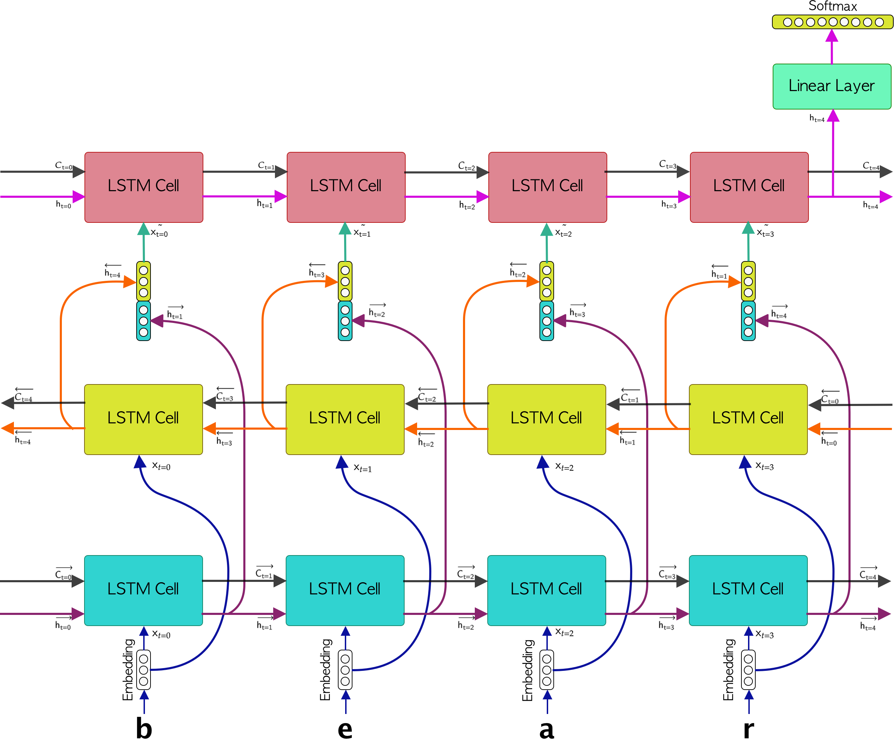

# Text Generation with Bi-LSTMs in PyTorch

This repository presents a model for text generation using Bi-LSTM and LSTM recurrent neural networks. The model is implemented using PyTorch's LSTMCells. 

If you want to read the details of these Text Generator model, I highly suggest to read the blog:
<a href="/">Text Generation with Bi-LSTM in PyTorch</a>

## 1. Files
- The ``data`` directory contains the text which we will work with. 
- The ``src`` directory contains the file ``model.py``which contains the neural net definition
- The ``utils`` directory contains helper functions such as the preprocessor and the parser
- The ``weights`` directory contains the trained weights.

## 2. The model
The architecture of the proposed neural network consists of an embedding layer followed by a Bi-LSTM as well as a LSTM layer. Right after, the latter LSTM is connected to a linear layer. The following image describes the model architecure. 
<p align="center">

</p>

## 3. Dependencies
In order to install the correct versions of each dependency, it is highly suggested to work under a virtual environment. In this case, I'm using the ``pipenv`` environment. To install the dependencies you just need type:
```
pipenv install
```
then, in order to lauch the environment you would need to type:
```
pipenv shell
```
## 4. Demo
For this demos we are going to make use of the book that is in the ``data/book`` directory, the credentials of the book are:
```
book_name: Jack Among the Indians
author: George Bird Grinnell
chapter: 1
url: https://www.gutenberg.org/cache/epub/46205/pg46205.txt
```
First lines of the book:
```
The train rushed down the hill, with a long shrieking whistle, and then
began to go more and more slowly. Thomas had brushed Jack off and
thanked him for the coin that he put in his hand, and with the bag in
one hand and the stool in the other now went out onto the platform and
down the steps, Jack closely following.
```
The best results were obtained by training the model with the following parameters:
```
python -B main.py --window 100 --epochs 50 --hidden_dim 128 --batch_size 128 --learning_rate 0.001
```
The weights of the trained model are stored in the ``weights/``directory. 
To generate text, we are going to load the weights of the trained model as follows:
```
python -B main.py --load_model True --model [weights/your_model.pt]
```
The text generated is:
```
Seed:
one of the prairie swellswhich gave a little wider view than most of them jack saw quite close to the

Prediction:
one of the prairie swellswhich gave a little wider view than most of them jack saw quite close to the wnd banngessejang boffff we outheaedd we band r hes tller a reacarof t t alethe ngothered uhe th wengaco ack fof ace ca  e s alee bin  cacotee tharss th band fofoutod we we ins sange trre anca y w farer we sewigalfetwher d e  we n s shed pack wngaingh tthe we the we javes t supun f the har man bllle s ng ou   y anghe ond we nd ba a  she t t anthendwe wn me anom ly tceaig t i isesw arawns t d ks wao thalac tharr jad  d anongive where the awe w we he is ma mie cack seat sesant sns t imes hethof riges we he d ooushe he hang out f t thu inong bll llveco we see s the he haa is s igg merin ishe d t san wack owhe o or th we sbe se we we inange t ts wan br seyomanthe harntho thengn  th me ny we ke in acor offff  of wan  s arghe we t angorro the wand be thing a sth t tha alelllll willllsse of s wed w brstougof bage orore he anthesww were ofawe ce qur the he sbaing tthe bytondece nd t llllifsffo acke o t in ir me hedlff scewant pi t bri pi owasem the awh thorathas th we hed ofainginictoplid we me
```